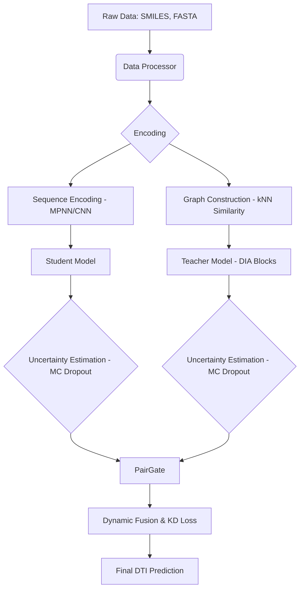

# DeepDTI: Uncertainty-Gated Student-Teacher Learning for Drug-Target Interaction Prediction

[](https://opensource.org/licenses/MIT)
[](https://www.python.org/downloads/)
[](https://pytorch.org/)

DeepDTI is a hybrid deep learning framework designed for robust Drug-Target Interaction (DTI) prediction. It leverages a **Student-Teacher architecture** combining sequence-based deep learning (Student) with graph-based interactive attention networks (Teacher), fused dynamically using **Uncertainty-Gated Fusion**.

---

## 🌟 Key Features

- **Hybrid Architecture**: Combines **DeepPurpose** (Sequence-based) and **MIDTI** (Graph-based) paradigms.
- **Uncertainty-Aware Fusion**: Implements **MC Dropout** to estimate prediction uncertainty, allowing the model to dynamically weight Student and Teacher outputs via a `PairGate`.
- **Knowledge Distillation**: Features a binary KD loss to guide the Student model using Teacher representations.
- **Advanced Graph Learning**: Utilizes **Deep Interactive Attention (DIA)** blocks and multi-view graph convolution (DD, PP, DP, DDPP).
- **Researcher-Friendly CLI**: Fully modularized codebase with YAML-based configuration management.
- **Comprehensive Metrics**: Optimized for research with AUPRC, AUROC, Concordance Index (CI), Pearson correlation, and more.

---

## 🏗 Architecture Overview

DeepDTI operates on a dual-pathway mechanism:

1.  **Student (Sequence Path)**: Uses Message Passing Neural Networks (MPNN) for drug SMILES and Convolutional Neural Networks (CNN) for protein sequences.
2.  **Teacher (Graph Path)**: Constructs k-Nearest Neighbor (kNN) similarity graphs and applies interactive attention to capture deep structural relationships.
3.  **Fusion Layer**: Calculates uncertainty $(\sigma^2)$ for both paths and uses a gating network to compute a dynamic weight $w$.

### Data & Model Flow



---

## 📂 Project Structure

```text
src/
├── data/           # Unified data loading and binarization
├── models/         # Advanced architectures
│   ├── student/    # Sequence-based encoders
│   ├── teacher/    # Graph-based DIA networks
│   └── fusion/     # Uncertainty-gated integration logic
├── core/           # Standardized Training/Evaluation engine
├── utils/          # Config loaders, metrics, and reproducibility
└── main.py         # Primary entry point
configs/            # Experiment configuration (YAML)
data/               # Datasets (DAVIS, KIBA, BindingDB)
output/             # Results, checkpoints, and logs
```

---

## 🚀 Getting Started

### 1. Installation

```bash
git clone https://github.com/your-repo/DeepDTI.git
cd DeepDTI
pip install -r requirements.txt
```

### 2. Configuration

All hyperparameters are managed via `configs/default.yaml`. You can modify model dimensions, training epochs, and dataset paths directly in this file.

### 3. Running Experiments

```bash
# Run with default configuration (KIBA)
python -m src.main

# Run with a specific experiment config
python -m src.main --config configs/davis_experiment.yaml
```

---

## 📊 Evaluation & Methodology

DeepDTI supports a wide array of metrics to ensure state-of-the-art evaluation:

| Category | Metrics |
| :--- | :--- |
| **Traditional DTI** | AUPRC, AUROC |
| **Regression-style** | Concordance Index (CI), MSE, RMSE, Pearson |
| **Classification** | Accuracy, F1, Precision, Recall, Specificity |

### Training Logic
The framework uses a composite loss function:
$$ \mathcal{L} = \mathcal{L}_{BCE} + \alpha \cdot \mathcal{L}_{KD} + \beta \cdot \mathcal{L}_{Reg} $$
Where $\mathcal{L}_{KD}$ is the binary knowledge distillation loss and $\mathcal{L}_{Reg}$ is the gate regularization.

---

## 📝 Citation

If you use this code in your research, please cite our project:

```bibtex
@article{deepdti2026,
  title={DeepDTI: Uncertainty-Gated Student-Teacher Learning for Drug-Target Interaction Prediction},
  author={DeepDTI Team},
  year={2026},
  journal={arXiv preprint}
}
```

---

## ⚖ License

This project is licensed under the **MIT License** - see the [LICENSE](LICENSE) file for details.